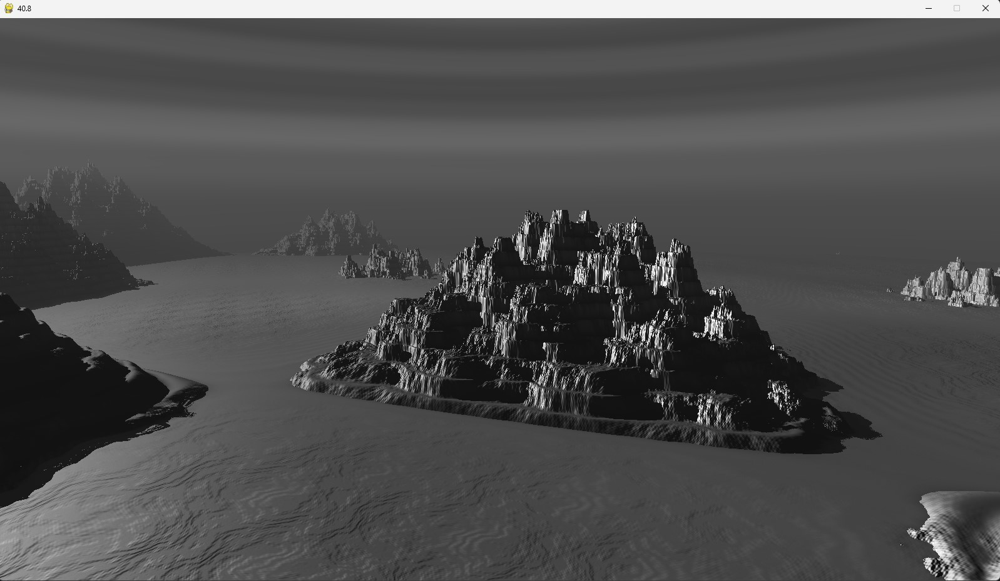
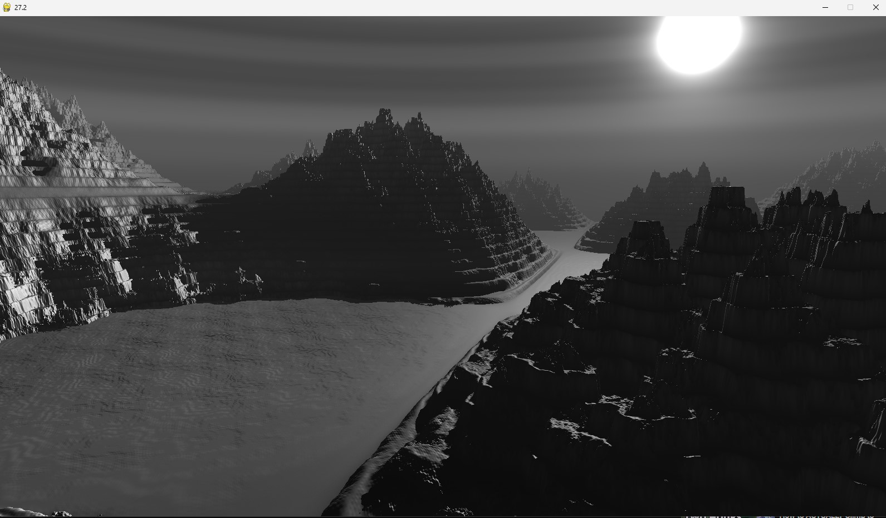

# Terrain-Generation
Procedural terrain generation using sine function with Python and OpenGL
Based on a tutorial by [CoderSpaceChannel](https://www.youtube.com/@CoderSpaceChannel)

Window size is 1600x900:

